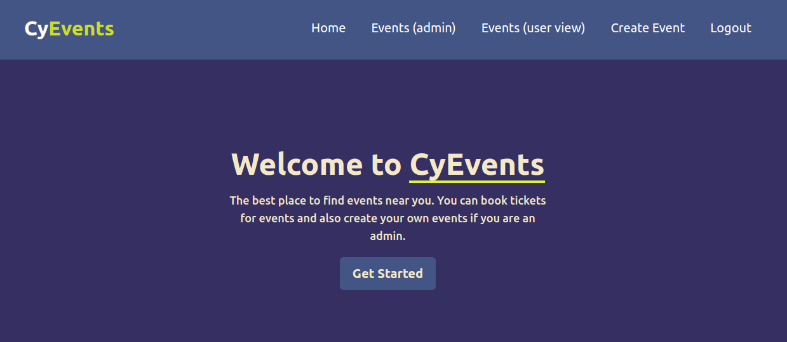
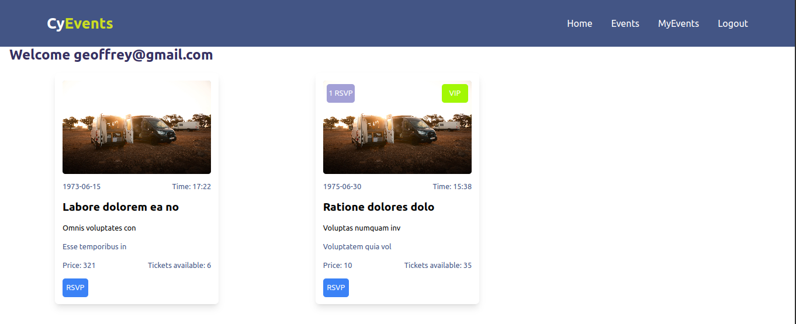
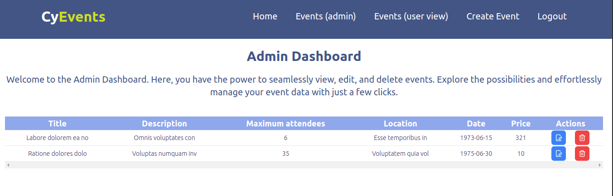
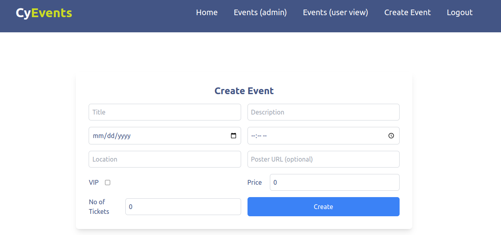
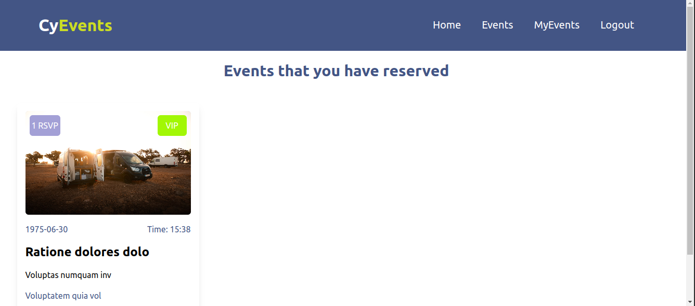

## Cy Events 
Cy Events is a ticket booking system application that allows users to view events details and reserve tickets. The administrator can add/ edit or remove events, specify the ticket price specifying ticket type (VIP and regular) and also specify the maximum number of attendees.

## Note

For testing admin functionalities, use the following credentials:
- Email: admin@gmail.com
- Password: admin12

## Technologies Used
- React
- Firebase
- Tailwind CSS
- React Router

## 
1. Landing Page

2. Dashboard

3. Admin Dashboard

4. Create Event (Admin)

5. Reserved Tickets (User)

## Installation
- Clone the repository
- Change directory to the project directory
- Run `npm install` to install the dependencies
- Run `npm start` to start the application

## Features

- Admin can add/ edit or remove events
- Admin can specify the ticket price specifying ticket type (VIP and regular)
- Admin can specify the maximum number of attendees
- Users can view events details and reserve tickets
- Users can reserve up to 5 tickets
- Users can get an email notification for the successful reservation

